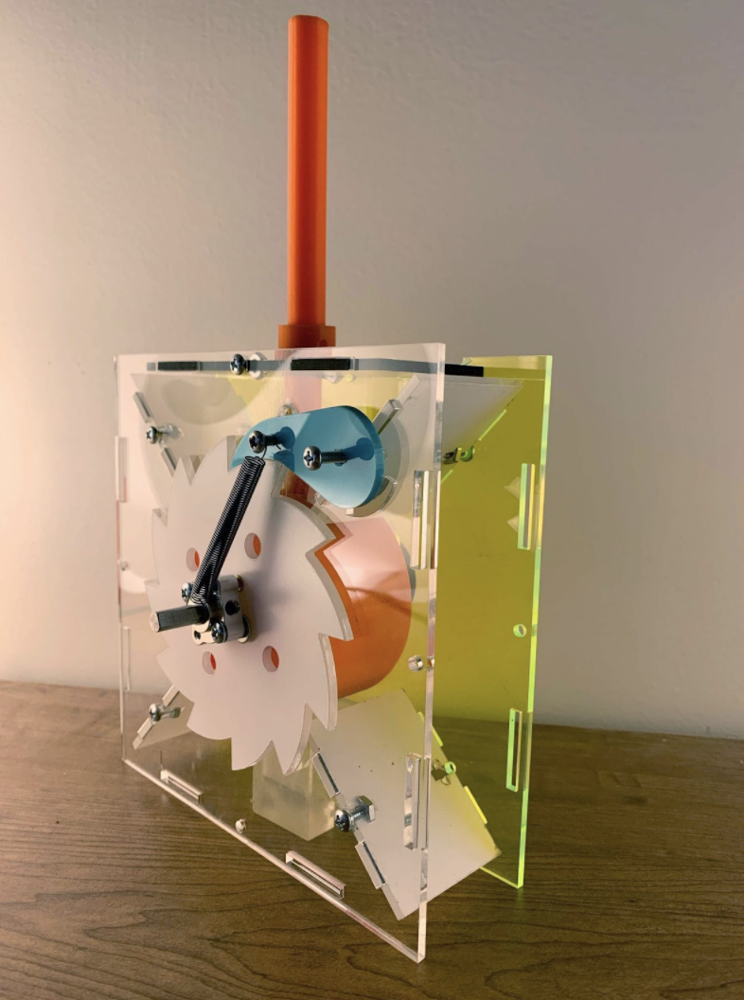
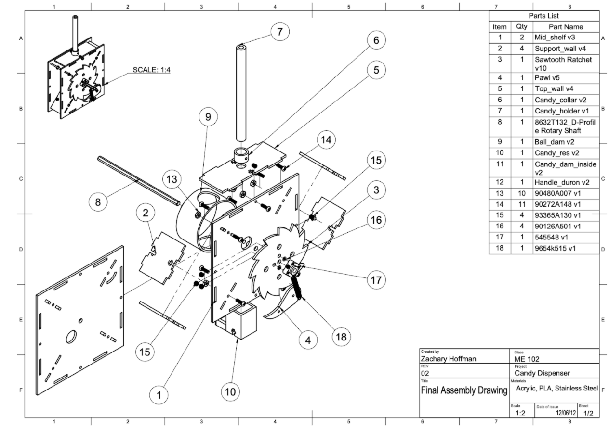
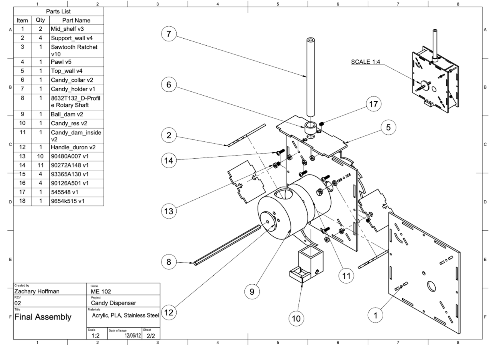

# Candy Dispenser

Final project for ME102. Designed in Fusion360 and created with various kinds of 3d printers and laser cutters.
Goal was to utilize a rotational mechanism to dispense one candy at a time.

## [Photo essay for project](CandyDispenserPhotoEssay.pdf)

  
  
  

